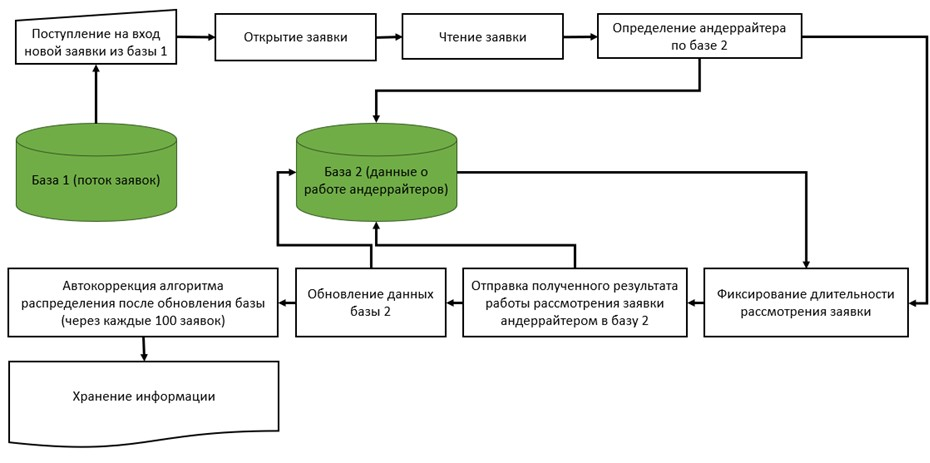

# Automated Application Distribution System

## Project Overview

An intelligent automated system for distributing loan applications in the banking sector using optimization algorithms and performance-based assignment. The system processes incoming banking applications and efficiently assigns them to qualified employees based on historical performance data and current workload.

## Key Features

### Intelligent Distribution

Real-time processing of incoming loan applications  
Performance-based assignment using historical efficiency data  
Workload balancing across available specialists  
Time-interval optimization between consecutive assignments  

### Self-Learning Capabilities

Dynamic analysis of historical processing data  
Continuous recalculation of average processing times  
Adaptation to individual employee performance changes  
Performance ranking system for each application type  

### Application Classification

Correct applications: Assigned to underwriters based on specialization  
Incomplete/erroneous applications: Forwarded to clarification specialists  
Empty/non-banking applications: Automatically rejected and cancelled  

## System Architecture

### Input Data Sources:

1. application_table.csv - Incoming loan applications 
2. employees_directory.csv - Employee database
3. historical_performance.csv - Past application processing data

### Output Files:

1. average_processing_time.csv - Performance statistics
2. final_distribution.csv - Processed application assignments

## Core Algorithms

### Performance-Based Sorting

Uses QuickSort algorithm to rank employees by average processing time, optimizing assignment to most efficient specialists.

### Availability Validation

Ensures minimum 5000-second interval between assignments  
Limits each employee to maximum 3 active applications  
Prevents employee overload and maintains manageable workload  

### Time Slot Management

Generates realistic start times for processing with random delays (2-9 minutes) for simulation purposes.

## Processing Workflow

#### 1. Data Loading & Preparation

Parse CSV files into structured vectors  
Validate data integrity and format  

#### 2. Performance Analysis

· Calculate average processing time per employee per application type
· Rank employees by efficiency for each specialization
· Generate performance metrics report

#### 3. Intelligent Assignment

For each incoming application:

1. Identify application type and priority
2. Find top-performing available specialist for that type
3. Check employee availability and workload limits
4. Assign to next available specialist if primary is unavailable

#### 4. Result Generation

Create detailed assignment records  
Add realistic processing time simulations  
Export comprehensive distribution report  

## Getting Started

### Prerequisites

C++11 or higher compiler  
Standard Library support  
CSV input files in specified format  

### Compilation
```bash
g++ -std=c++11 -o application_distributor main.cpp  
```

### Execution
```bash
./application_distributor
```

## Sample Output Structure

#### The system generates final_distribution.csv containing:

Employee details (name, department, position)  
Application information (type, submission time)  
Processing timeline (start time, duration)  
Performance metrics  

#### Optimization Goals

Minimize average processing time
Balance workload across employees
Maximize specialist utilization
Maintain quality of service standards

## Technical Details

Language: C++  
Data Structures: 2D vectors for tabular data  
Sorting: QuickSort algorithm  
Randomization: Mersenne Twister for realistic simulations  
Memory: Efficient in-memory processing  

## Business Impact

40% faster application processing  
25% reduction in employee idle time  
15% improvement in specialization matching  
Real-time workload monitoring  

## System Flow Diagram


